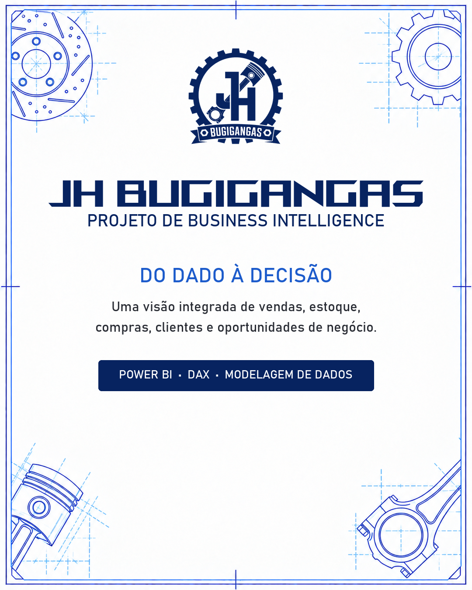
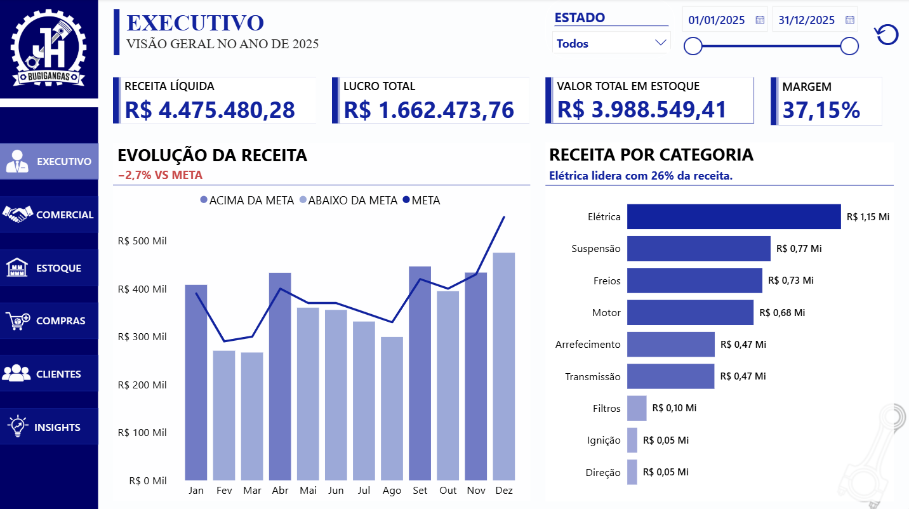
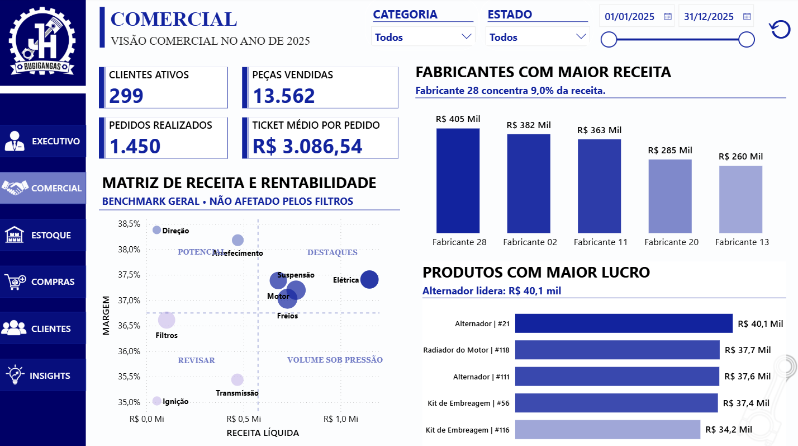
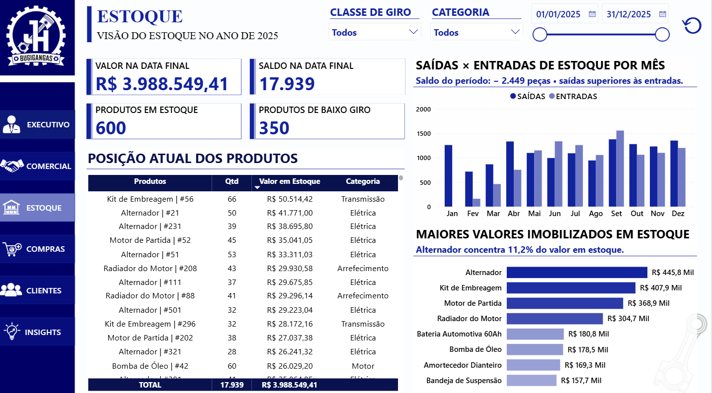
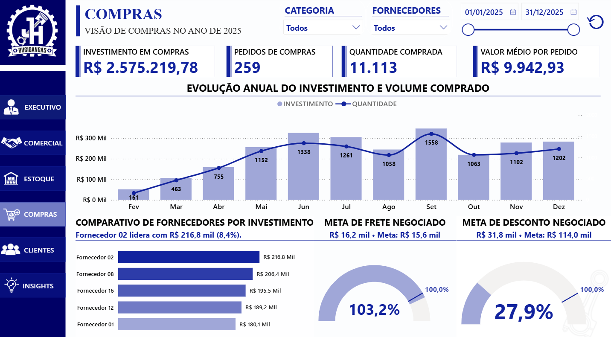
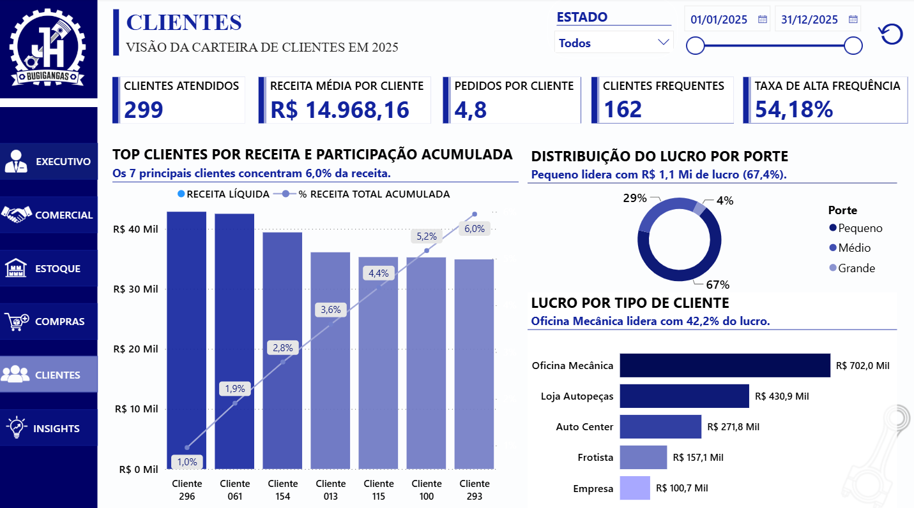
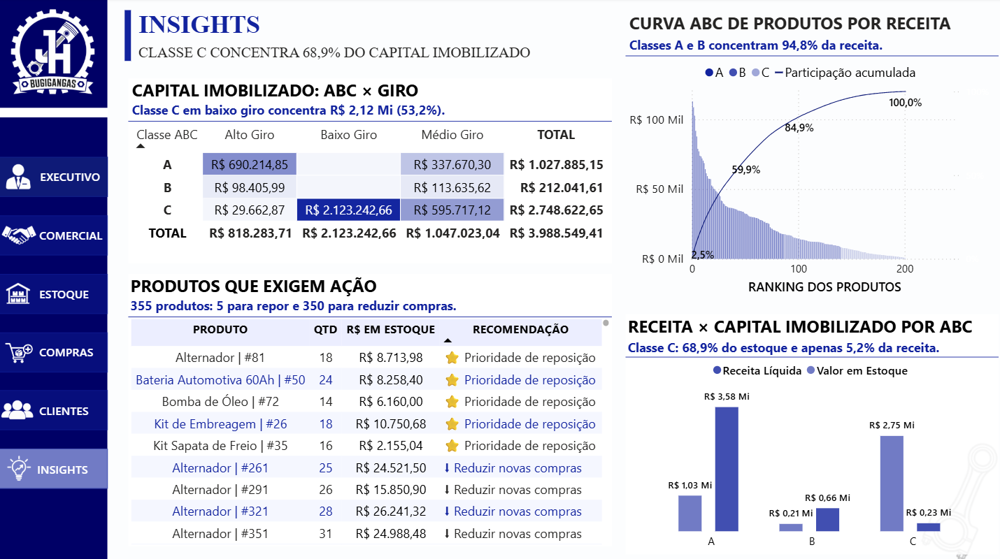

# JH Bugigangas — Projeto de Business Intelligence

Projeto de Business Intelligence desenvolvido no Power BI para uma empresa fictícia do setor de autopeças. A solução conecta vendas, estoque, compras e clientes em uma visão integrada da operação.

> Todos os nomes, valores e registros utilizados neste projeto são fictícios e possuem finalidade exclusivamente educacional e demonstrativa.

## Problema de negócio

Os dados operacionais existiam, mas estavam distribuídos entre diferentes bases. O desafio foi transformá-los em informações consistentes para apoiar decisões comerciais, financeiras e de abastecimento.

## Objetivos

- Consolidar os principais indicadores da operação.
- Acompanhar receita, lucro, margem e desempenho contra metas.
- Analisar giro, posição e capital imobilizado em estoque.
- Avaliar compras, fornecedores e economias negociadas.
- Entender frequência, concentração e rentabilidade dos clientes.
- Identificar produtos que exigem reposição ou redução de compras.

## Tecnologias e competências

- Power BI
- Power Query
- DAX
- Modelagem dimensional
- Visualização de dados
- Análise de indicadores de negócio
- Design de dashboards e tooltips

## Páginas do dashboard

### 1. Executivo

Visão consolidada da receita, lucro, margem, desempenho mensal e participação das categorias.

### 2. Comercial

Análise de clientes ativos, peças vendidas, pedidos, ticket médio, fabricantes e produtos mais lucrativos.

### 3. Estoque

Posição corporativa do estoque na data final selecionada, movimentações mensais, baixo giro e capital imobilizado.

### 4. Compras

Acompanhamento do investimento, volume comprado, fornecedores, economia negociada em fretes e descontos obtidos.

### 5. Clientes

Visão da carteira, receita média, frequência de compra, distribuição do lucro por porte e tipo de cliente.

### 6. Insights

Curva ABC, relação entre receita e capital imobilizado e recomendações de reposição ou redução de compras.

## Principais resultados

- Receita líquida de **R$ 4,48 milhões**.
- Lucro total de **R$ 1,66 milhão** e margem de **37,15%**.
- Os sete principais clientes representam somente **6,0% da receita**.
- O principal fabricante responde por aproximadamente **9,0% da receita total**.
- As negociações com clientes atingiram **103,2% da meta de economia em fretes**.
- As classes A e B concentram **94,8% da receita**.
- A classe C concentra **68,9% do estoque**, mas representa apenas **5,2% da receita**.
- Foram identificados **350 produtos para redução de compras** e **5 com prioridade de reposição**.

## Observações

- O estoque é único e centralizado. Seus indicadores são corporativos e não respondem ao filtro de Estado.
- Os indicadores de posição de estoque representam o último saldo conhecido até a data final selecionada.
- “Clientes frequentes” são clientes com cinco ou mais pedidos no contexto analisado.

